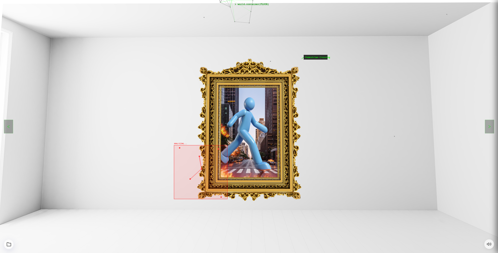
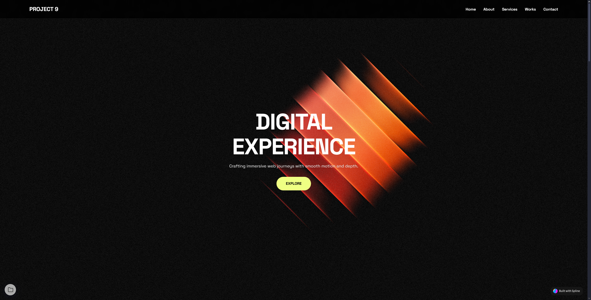

# ET-710 Projects

A collection of web development projects for the ET-710 course.

## Project Showcase

## Projects List

- **Project 1**: [View Project](Project_1/Project_1.html)
- **Project 2**: [View Project](Project_2/Project_2.html)
- **Project 3**: [Part 1](Project_3/Project_3_1.html) | [Part 2](Project_3/Project_3_2.html)
- **Project 4**: [View Project](Project_4/Project_4.html)
- **Project 5**: [View Project](Project_5/Project_5.html)
- **Project 6**: [View Project](Project_6/Project_6.html)
- **Project 7**: [Part 1](Project_7/Project_7_1.html) | [Part 2](Project_7/Project_7_2.html)
- **Project 8**: [View Project](Project_8/Project_8.html) ⭐
- **Project 9**: [View Project](Project_9/Project_9.html) ⭐⭐
- **Project 10**: [View Project](Project_10/Project_10.html)
- **Project 11**: [View Project](Project_11/Project_11.html) ⭐⭐⭐
- **Project 12**: [View Project](Project_12/Project_12.html)

## Navigation

A global navigation system has been implemented across all projects, allowing easy traversal between assignments.
